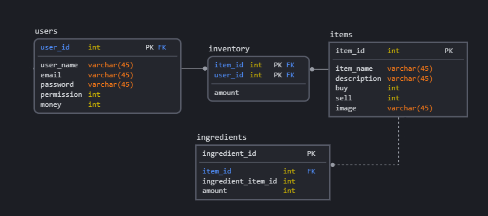

# Rendszerterv

##  A rendszer célja
A felhasználó egy olyan rpg (role playing game, avagy szerepjáték) játékkal játszhasson, amely a tipikus magyar szokásokat és jellegzetességeket eleveníti meg különböző tevékenységek formájában.
A felhasználónak a játék megkezdéséhez köteleőzen regisztrálnia kell.
Regisztráció után, pedig minden alkalommal a bejelentkezés elvégzését követően kezdhet el játszani.
Ezen alapon minden felhasználó saját profillal rendelkezik a játékban, amelyben rögzül az előrehaladása,
így ha úgy dönt, hogy később folytatná a megkezdett játékot akkor nem vész kárba a befektetett idő.
A felhasználónak lehetősége lesz a játék egyes elemeinek elsajátítására, amellyel az adott feladatban fejlődik és elvégzésében egyre jobb lesz.

Ilyen feladat például:
	- Halászat
	- Pálinkafőzés
	- Zsákmányolás

A rendszer a karanténban töltött idő mókásabb eltöltését kívánja elősegíteni.
A rendszer fejlesztése nagyrészt Javascriptben fog megvalósulni.

## Projektterv
### Szerepkörök
- Designer & Developer: Csontos Dominik
- Senior Designer: Palotai Martin
- Designer & Developer: Kóder László
- Designer & Developer: Sirák Norbert

### Egyéni Projekt Munkálatok
- Design elkészítése: Csontos Dominik
- Keretrendszer elkészítése: Palotai Martin
- Halász applikáció: Sirák Norbert
- Pálinkafőző applikáció: Kóder László
- Fosztogatás applikáció: Csontos Dominik

### Közös feladatok
- Követelmény Specifikáció megírásában történő közreműködés
- Funkcionális Specifikáció megírásában történő közreműködés
- Rendszerterv megírásában történő közreműködés

### Mérföldkövek
1. Keretrendszer elkészítése
2. Applikációk elkészítése
	- Halász applikáció elkészítése
	- Pálinkafőző applikáció elkészítése
	- Fosztogatás applikáció elkészítése
3. Design elkészítése

## Üzleti folyamatok modellje
A játékokkal kapcsolatos elvárások és igények kielégítésére az ügyfél website-ja már kevésbé alkalmas, mint korábban,
aminek következtében csökkent az aktív felhasználóinak száma. Az emberek manapság sokkal inkább érdeklődnek az RPG
jellegű játékok felé, épp ezért a cél egy ilyen jellegű játék létrehozása, mely alkalmazkodik az eddigi üzleti folyamatokhoz: 
van benne pénzszerzési lehetőség, illetve a régi felhasználók fiókjaiból is lehet használni a játékot, ezáltal egy újabb,
szórakoztatóbb lehetőséget teremtve az ajándékok megszerzésére, vagy akár az előfizetés fedezésére.
### Célok
- Átlátható felhasználói felület készítése a játékhoz
- Élvezetes játékmenet megvalósítása
- Az aktivitás általános felpezsdítése az ügyfél website-ján
- Nagyob, közösségre alapuló projektek lehetőségeinek megteremtése (pl.: fórum)
- Többféle eszközről is játszható játék, ami növeli a népszerűséget
- Kompatibilitás az előfizetői rendszerrel
- Kizárólag előfizetett fiókok támogatása az ajándékok beváltását illetően, ami növeli a nyilvántarthatóságot
- Korábbi felhasználói fiókokkal való kompatibilitás
### Előnyök
- Új játékosbázis
- Régi játékosok visszacsábítása a platformra
- Új promóciós lehetőségek
- Új ajándékok
- Új előfizetési csomagok lehetősége
- Nagyobb profit elérése
- A játék jellegéből adódóan: népszerűség internetes tartalomgyártók körében
### Rendszerek
#### Feliratkozás alapú rendszerek
- A felhasználó fizet egy meghatározott játékidőért -> Játszik a játékkal -> A játékmodell miatt egyfajta napi szokássá fejlődik a játék -> A fizetett játékidő lejár
- A szokás erőssége miatt nagy eséllyel megújítja a feliratkozást
- Előny: Általában játékon belüli valutával beváltható a feliratkozás. Folytonos támogatottsága van a játéknak míg a cég reputációja megfelelő.
- Hátrány: Nagyon drága lehet hosszú távon ha nem fektet bele elég időt a felhasználó. Egyfajta dependenciát válthat ki a játékmodell, mely kényszeríti a minden napos játékra.
#### Megvétel alapú rendszerek
- A felhasználó fizet az alap játékért -> Annyi ideig játszik vele ameddig kíván
- Általában plusz tartalmat szoktak ezek a játékokhoz gyártani, melyet újabb fizetés után érhet el a felhasználó
- Előny: Megadott ár egyszeri fizetése, előre tudjuk miért fizetünk.
- Hátrány: A játék támogatottsága nem hosszú idejű.
#### Ingyenes rendszerek
- A felhasználó ingyen elérheti a játékot.
- Monetizációra három lehetőség gyakori: kinézetek eladása, gambling, pay-to-win elemek.
- Előny: A felhasználótól függ a költött összeg. Hosszú támogatottság a jó monetizáció miatt.
- Hátrány: Ha pay-to-win elemekkel rendelkezik a játék költekezés nélkül nem olyan élvezetes. Gambling függőséget okozhat ami komoly probléma.

## Követelmények
### Funkcionális követelmények
- Navigáció: fontos egy praktikusan használható navigációs szegmens kialakítása, melyen keresztül a felhasználó egyszerűen és gyorsan tud váltani az applikáció funkciói között. A tervek szerint a profilt, boltot, admin panelt és hasonló funkciókat egy felső navigációs szegmensből, a tényleges játékmenetet magába foglaló kisebb alkalmazásokat pedig egy oldalt elhelyezkedő navigációs szegmensen keresztül lehet majd elérni.
- Admin panel: csak az "admin" szintű felhasználó számára jelenik meg ez a fül, a lényege, hogy az admin be tud állítani magának bizonyos szinteket és értékeket a játékon belül (pl.: pecázási szint, pénzmennyiség). Ennek a funkciónak az elsődleges célja az applikáció többrétűen történő demonstrálásának az elősegítése.
- Bolt: a felhasználó itt tud kereskedni az általa megszerzett vagy előállított erőforrásokkal, továbbá bizonyos játékokhoz itt tud felszerelést vásárolni. A játékmenetet elősegítő dolgokat is tud vásárolni, pl.: az eladási árnál drágábban tud halat venni. Az árukészlet bizonyos időközönként frissül.
- Profil: a felhasználó itt a felhasználói fiókkal kapcsolatos beállításokat végezheti el.
- Játékmenet: az erőforrások beszerzését, azok hasznosítását, illetve a játékos szintjének növelését a játék ehhez kapcsolódó alfunkcióiban lehetséges kivitelezni, például pecázni a pecázós appban lehet, pálinkát főzni pedig a pálinkafőzdében. Ezen-appokhoz fűződnek a készségi szintek is.
- Looting: a looting vagy fosztogatás a játék egy fontos eleme lesz, mellyel bármilyen nyersanyagot, fémet, pénzt vagy ételt meg tud szerezni, de ezeket az utcán, boltokból kell másoktól elvennie. A szerzett dolgokat felhasználhatja eladásra vagy egyéb, máshogyan nem megszerezhető dolgok elkészítésére, hiszen a túlélésért mindent meg kell tennie.
### Nem funkcionális követelmények
- Ikonok használata az egyes erőforrások leltárban és boltban való reprezentálására.
- Leltár megjelenítése, a leltárban mindig az adott tevékenységhez valamilyen módon köthető dolgok jelennek meg
- Felhasználóbarát grafikus interface kialakítása, melyet könnyű átlátni és kezelni.
- Progress bar az egyes mesterségekhez, szintek jelöléséhez
- Poszt-apokaliptikus hangulat megteremtése a design egyes elemeit illetően, illetve egyedi, játékelemmel kapcsolatos kinézet kialakítása al-applikációnként.
- Reszponzív megjelenítés.

## Funkcionális terv
	Rendszerszereplők:
		Admin.
		Felhasználó.
	Rendszerhasználati esetek:
		Admin:
			Bejelentkezés
			módosítani tudja a felhasználók nevét 
			módosítani tudja a felhasználók jelszavát.
        	módosítani tudja a felhasználók  minden játékban szerzett eredményét. 
		Felhasználó: 
			Bejelentkezés
			Regisztráció

## Fizikai környezet
A teszt webes környezetben és minden böngészőben reszponzívnak készül el.
Nincsenek megvásárolt komponenseink.
Fejlesztői eszközök:
    Sublime text
    Visual studio code
    
## Architekturális terv

Backend:

A rendszerhez szükség van egy adatbázis szerverre, mely a mi esetünkben
MySQl-t használunk. A kliens oldali programokat egy php alapú REST api
egítségével valósítjuk meg, ez csatlakozik az adatbázis szerverhez. 
A kliensekkel ajax kérésekkel kommunikál.

Web Kliens:

A web alkalmazás JS keretrendszer használatával készül el.
Javascript modulok segyítségével.

## Adatbázis terv

## Implementációs terv
A Webes felület főként HTML, CSS, PHP és Javascript nyelvet fog tartalmazni.
Ezeket a technológiákat amennyire csak lehet külön fájlokba írva készítjük, és
úgy fogjuk egymáshoz csatolni a jobb átláthatóság, könnyebb változtathatóság,
és könnyebb bővítés érdekében.Egyedi eseteket leszámítva melyeknél előfordul hogy Javascript nyelvű funkciókat
illesztünk be oldalakba a könnyebb kezelhetőség szem előtt tartása miatt.Képes lesz felhasználni a Backend részen futó
REST szolgáltatás metódusait, ezáltal tud felvinni és lekérdezni adatokat az
adatbázisból.

## Tesztterv
A teszteléseink célja a teljes rendszer és annak minden játékmódja és azok minden komponensei 
funkcionalitásának hiánytalan vizsgálata, ellenőrzése.
A rendszerbéli hiányosságok feltárása és javítása.
A tesztelésink metódusait három fő komponensre tudjuk bontani melyek:
Az első minden egyes funkció megírásakor az a fejleszés akkori szakaszában valósul meg 
amikor a fejlesztő előszőr lefuttatja az adott funkciót és megnézi a kapott választ.
A második amikor az adott funkció böngészőben megvalósított formában kerül futtatható formátumban.
Ekkor a fejlesztő mint egyszerű játékos próbálja ki a funkciót minden lehetséges módon és az ezekből kapott válaszokat 
nézi a webalkalmazás console felületén. Ezen válaszok alapján tudja értékelni, hogy az adott funkció tökéletesen működik, 
vagy hiba van bizonyos eljárások, logikák során. Melyek javítást igényelnek.
A harmadik amikor az eddig meglévő funkcióknak a különböző böngészőkkel való kompatibilitásának tesztelése. 
Ezeket a lépéseket bármelyik fejlesztő végezheti és nem csak a saját részlegét tesztelheti ilyen módon.
Az eljárás sikeres, ha különböző böngészőkben is
megfelelően működik minden funkciók, és akkor ér véget ha minden funkciót sikeresen tesztelt.

Tesztelendő funkciók:

Adatbázis: 

Képesnek kell lennie a kapott adatokat táblákban megjeleníteni. 
Képesnek kell lennie a táblákban lévő adatokat kérés hatására megadnia a webes alkalmazásnak.
Képesnek kell lennie kérés hatására a lekért adatokat megjelenítenie.

Login felület:

A login/regisztrációs felület elrendezésének ellenőrzése: 
Elvárt működés: az elképzelt kinézethez képest megfelelően kell
kinéznie, a képernyő méretétől függetlenül.

Regisztrációs felület:

A regisztrációs felületnek elérhetőnek kell lennie a kezdőképernyőn 
a bejelentkezési lehetőség mellett. Amennyiben a felhasználó még nincs regisztrálva 
az itt található gombra kattintva kell átirányítani a regisztrációs felületre. 
Ezen felületen a megfelelő adatok megadása mellett a megerősítés gombra kattintva a felhasználó
regisztrációjának meg kell történnie az adatbázis segítségével.
Majd elérhetővé kell tenni a bejelentkezést a felhasználó számára.
Hibás,ross+z formátumban megadott regisztrációs adatok megadásakor 
hibaüzenetet kell kapjon a felhasználó.

Játékok felülete:

A játékok felületének képesnek kell lennie a funkcionális specifikációban megadott
képernyőtervek szerint megvalósulnia. Minden funkcióját betöltenie.

## Telepítési terv
Webes alkalmazás.
Mire van szükségünk ahhoz, hogy használni tudjuk, illetve min használhatjuk?
- Számítógép
- Mobiltelefon
- Tablet
- Egyéb eszköz amely képes böngésző futtatására.

- Böngésző program:
	- Google Chrome
	- Safari
	- Opera
	- Mozilla Firefox
	
- Stabil internetkapcsolat

Ha rendelkezünk valamelyik fenti eszközzel és azon telepített böngészővel,
akkor fel kell keresnünk a weboldalt, amelyet a "boredinquarantine.hu" címen érhetünk el.
Ezt követően szükségünk van egy regisztrációra.
Regisztráció után pedig csupán be kell jelentkeznünk.

## Karbantartási terv
Ellenőrizni kell a jövőben kiadott böngészési verziókhoz való 
kompatibilitást és reszponzivitást. Majd ha nem valósul meg 
kijavítani a jövőbeli böngészőkhöz is a teljes funcionalitást.
