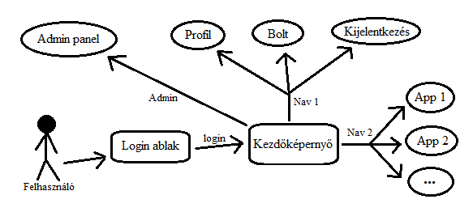
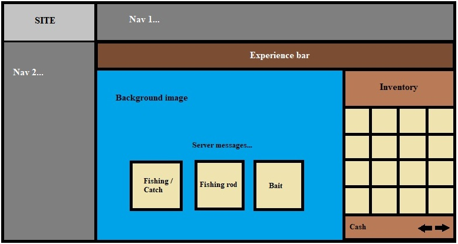
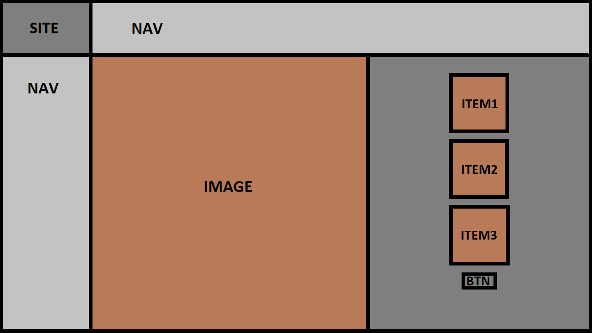

# Funkcionális specifikáció

##  Áttekintés

## Jelenlegi helyzet

## Követelmény lista
1. Jogosultság: 
    1.1 Regisztrációs felület: 
            A felhasználó a nevének és jelszavának megadásával regisztrálja
            magát. Ha valamelyik adat ezek közül hiányzik vagy nem
            felel meg a követelményeknek, akkor a rendszer értesítét küld.
    1.2  Bejelentkezési felület: 
            A felhasználó az email címe és a jelszava
            segítségével bejelentkezhet.
            Ha a megadott email cím vagy jelszó nem
            egyezik a felhasználóéval, akkor hibaüzenet jelenik meg.
    1.3 Jogosultsági szintek:
            Admin: Bejelentkezés regisztráció. 
            Felhasználók módósítása törlése felülírása. 
            Játék és minden funkciójának tesztelése.
            Játékos/Alap felhasználó: Bejelentkezés regisztráció.
            Teljes játékélmény minden funkciója.
2.Modifikáció:
    1.1 Admin modifikációk:
            Az admin módosítani tudja a felhasználók nevét jelszavát.
            Valamint minden játékban szerzett eredményét. Ez egyaránt használható 
            büntetésre és jutalmazásra is.
3.Felület:
    3.1: Pénz: 
            Megmutatja a játékos pénzét, hogy mire használhatja fel.
    3.2: Profil:
            Megmutatja a játékos profilját és minden eddig elért mesterségét és eredményét.
    3.3: Szint:
            Megmutatja a játékos szintjét és az ezzel járó bónuszokat.
    3.4: Kijelentkezés:
            Kijelentkezik a felhasználó profiljából
    3.5: Egyes játékszekciók:
            A játék egy egy funkciójához vezető oldalra lép.
    3.6: Admin panel:
            csak az admin szintű felhasználó számára jelenik meg ez a fül, a lényege, hogy az admin be tud állítani magának bizonyos szinteket és értékeket a játékon belül

## Jelenlegi üzleti folyamatok modellje

### Az alábbi üzleti folyamatmodellt kell átalakítani az Igényelt üzleti folyamatok modellje c. fejezet alapján:
- A megrendelő olyan weboldalt üzemeltet, amelyen különféle játékokat lehet játszani
- A játékokban szerzett pénzt valós ajándékokra lehet beváltani
- A pénz a felhasználói fiókon gyűlik
- Az ajándékokat promóciókból, reklámokból biztosítják
- Az ügyfél nem elégedett az aktív felhasználók számával és a profittal
- Az iménti probléma a játékok elavultságából ered -- már nincs ezekre a műfajokra akkora kereslet
- A játékoshiány kiküszöbölése érdekében szeretne megcélozni egy új csoportot egy úgy játékkal

## Igényelt üzleti folyamatok modellje

A játékokkal kapcsolatos elvárások és igények kielégítésére az ügyfél website-ja már kevésbé alkalmas, mint korábban, 
aminek következtében csökkent az aktív felhasználóinak száma. Az emberek manapság sokkal inkább érdeklődnek az RPG
jellegű játékok felé, épp ezért a cél egy ilyen jellegű játék létrehozása, mely alkalmazkodik az eddigi üzleti folyamatokhoz: 
van benne pénzszerzési lehetőség, illetve a régi felhasználók fiókjaiból is lehet használni a játékot, ezáltal egy újabb,
szórakoztatóbb lehetőséget teremtve az ajándékok megszerzésére.
### Célok
- Átlátható felhasználói felület készítése a játékhoz
- Élvezetes játékmenet megvalósítása
- Az aktivitás általános felpezsdítése az ügyfél website-ján
- Nagyob, közösségre alapuló projektek lehetőségeinek megteremtése (pl.: fórum)
- Többféle eszközről is játszható játék, ami növeli a népszerűséget
- Kizárólag regisztrált fiókok támogatása az ajándékok beváltását illetően, ami növeli a nyilvántarthatóságot
- Korábbi felhasználói fiókokkal való kompatibilitás
### Előnyök
- Új játékosbázis
- Régi játékosok visszacsábítása a platformra
- Új promóciós lehetőségek
- Új ajándékok
- Nagyobb profit
- A játék jellegéből adódóan: népszerűség internetes tartalomgyártók körében

## Használati esetek

### Ábra
- A felhasználó a bejelentkezést követően eljut a kezdőképernyőre
- Adminként szintű felhasználóként hozzáférhet az admin panelhez
- Normál szintű felhasználóként hozzáférhet a bolthoz és a profiljához
- Normál szintű felhasználóként hozzáférhet a játékmenet appjaihoz
- Ha be van jelentkezve, akkor megjelenik a kijelentkezés fül

## Megfeleltetés

## Képernyő tervek

### Horgászós app

## Forgatókönyv

## Funkció - követelmény megfeleltetés
    Jelenlegi követelményeinket megfeleltető funkciók:
    A felhasználói regisztráció funkció.
    A felhasználói bejelentkezés funkció.
    A jogusultsági rendszer funkciói.
    A halászat mint játék szekció funkciói.
    Pálinkafőzés játék szekció funkciói.
    Looting játék szekció funkciói.

## Fogalomszótár
 Admin:
 A felhasználók fölött álló vezető profil
 Platform:
 A felület szakkifejezésére használt szakszó.
 Website:
 A felület neve ahol az aplikáció futni fog.
 Profil:
 A felhasználó adatlapja.
